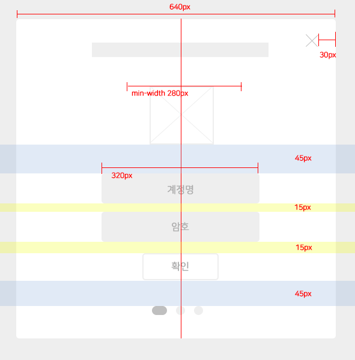

# 마크다운 작성법
작성자 : 홍지연

## 마크다운 문법

1. 제목(Header) : ```<h1> ~ <h6> 태그``` 
```
     # 제목1

     ## 제목2

     ### 제목3

     #### 제목4

     ##### 제목5
```

2. 강조 : ```<strong>, <em>, <del>, <u>```
```
     두껍게 : **텍스트**   /   __텍스트__

     이텔릭체 : **텍스트**   /   _텍스트_

     취소선 : ~~텍스트~~

     밑줄 : <u>텍스트</u>
```

3. 목록 : ```<ol>, <ul>```
```
     순서가 필요한 목록 : 1. 텍스트  2. 텍스트  3. 텍스트 ...

     순서가 필요없는 목록 : - 텍스트  /   * 텍스트   /    + 텍스트
```

4. 링크 : ```<a>```
```
     [텍스트](https://google.com)

     [텍스트](https://naver.com "링크 설명(title)을 작성하세요.")

     [상대적참조](../login 과 같은 상대경로 써주기)


    ** 다음과 같이 문서 내 일반 URL이나 꺽쇠 괄호(`< >`, Angle Brackets)안의 URL은 자동으로 링크를 사용합니다.

    구글 : httsp://google.com

    네이버 : <https://naver.com>

    ** 아래는 분리해서 작성할 경우

    [google][google link]

    [google link]: [https://google.com](https://dribbble.com/)

    [1]: [https://github.com](https://github.com/)

    [GitHub][1]
```

5. 이미지 : ``````
```
     

     ![google 홈][google]

     [google]: https://google.com "google"
```

6. 이미지에 링크
```
     [](https://google.com)
```

7. 코드 강조 : ```<pre>, <code>```
```
     - 인라인 코드 강조
     ` (Grave)를 입력
     `background` 속성으로 배경 이미지를 삽입할 수 있습니다.

     -블록 코드 강조
     ` 를 3번 이상 입력하고 코드 종류도 적습니다.
     ```html
     <a href="https://www.google.co.kr." target="_blank">GOOLE</a>
     ```
```

8. 테이블 : ```<table>```
```
     헤더 셀을 구분할 때 3개 이상의 -(hyphen/dash) 기호가 필요합니다.
     헤더 셀을 구분하면서 :(colons) 기호로 셀(연/칸) 안에 내용을 정렬할 수 있습니다.
     가장 좌측과 가장 우측에 있는 | (vertival bar) 기호는 생략 가능합니다.

     | 값 | 의미 | 기본값 |
     |---|:---:|---:|
     | `static` | 유형(기준) 없음 / 배치 불가능 | `static` |
     | `relative` | 요소 자신을 기준으로 배치 | |
```

9. 인용문 : ```<blockquote>```
```
     > 인용문장...
     >> 중첩된 인용문
     >>> 중중첩된 인용문 1
     >>> 중중첩된 인용문 2
     >>> 중중첩된 인용문 3
```

10. Raw HTML
```
     마크다운 문법이 아닌 Raw HTML 문법을 사용할 수 있습니다.
```

11. 수평선
```     
     각 기호를 3개 이상 입력하세요.
     ---
     ***
     ---
```

12. 줄바꿈
```
     <br> 또는 '2번의 띄어쓰기'
```

참고 : <https://heropy.blog/2017/09/30/markdown/>

